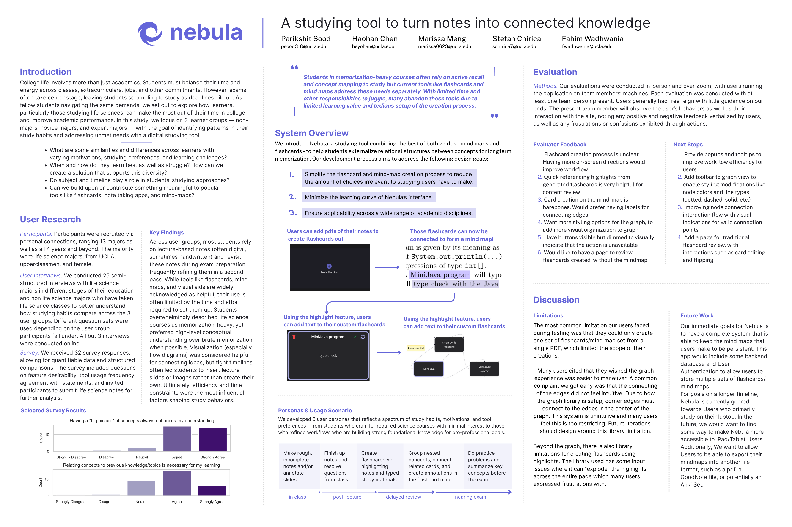

# Nebula



## Running the project
Once you open up the repository, run:

```
cd nebula
```
Then, on the first instance of opening the project, run:
```
npm install
```

Finally, to open the webpage, run:
```
npm start
```
.
## Interaction Flow 1
Our first interaction flow is making flashcards from highlighting a (preinstalled) PDF.

Simply highlight text to initialize the front of a flashcard, and highlight more text to initialize the back of a flashcard. Once the flashcard is created, you can click on it in the sidebar to select it, and double click on it to flip it.

## Interaction Flow 2
Our second interaction flow is creating a mind map from the flashcard set made from the first interaction flow. Double click on a card to read its front and back. Each card has 8 handles to allow connection lines to be formed with other cards.
