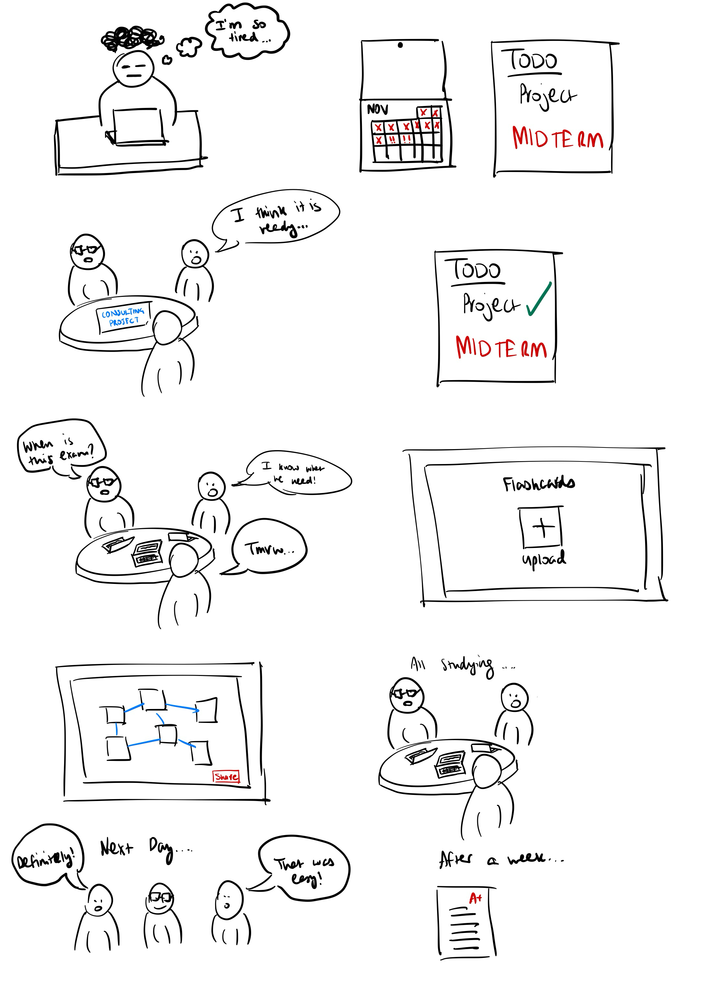
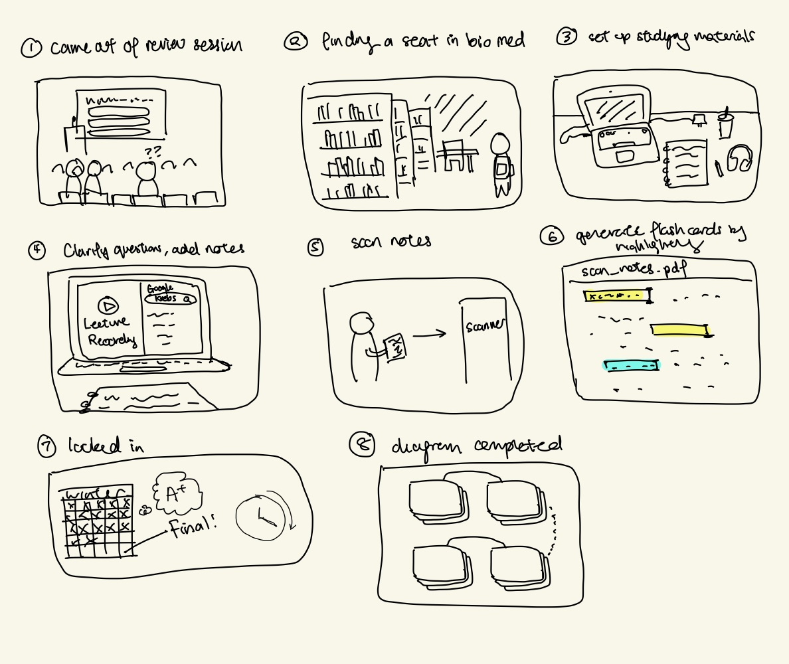
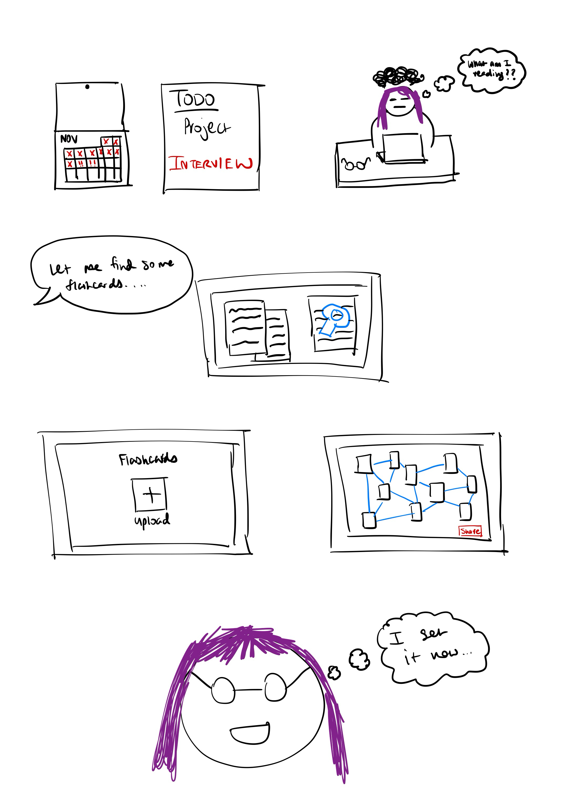
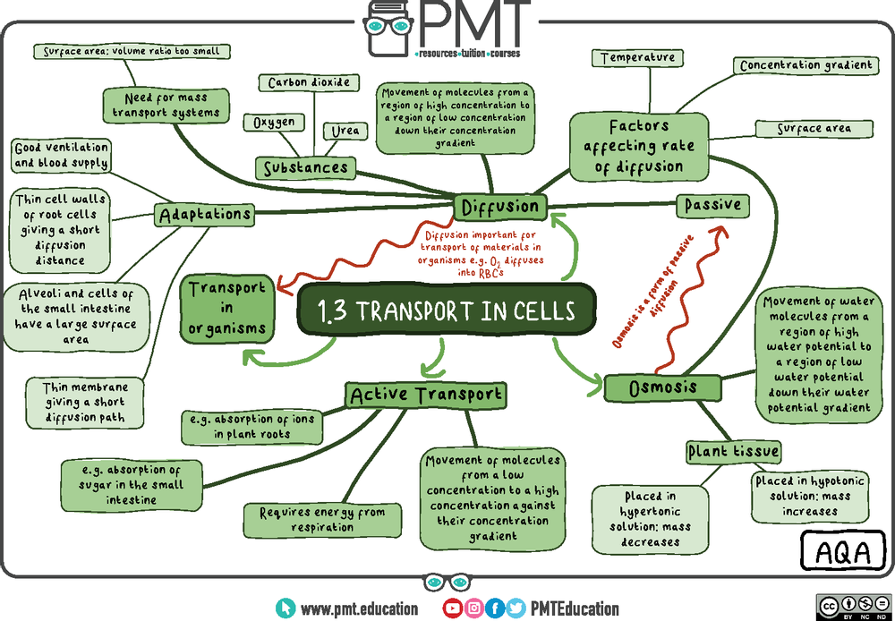
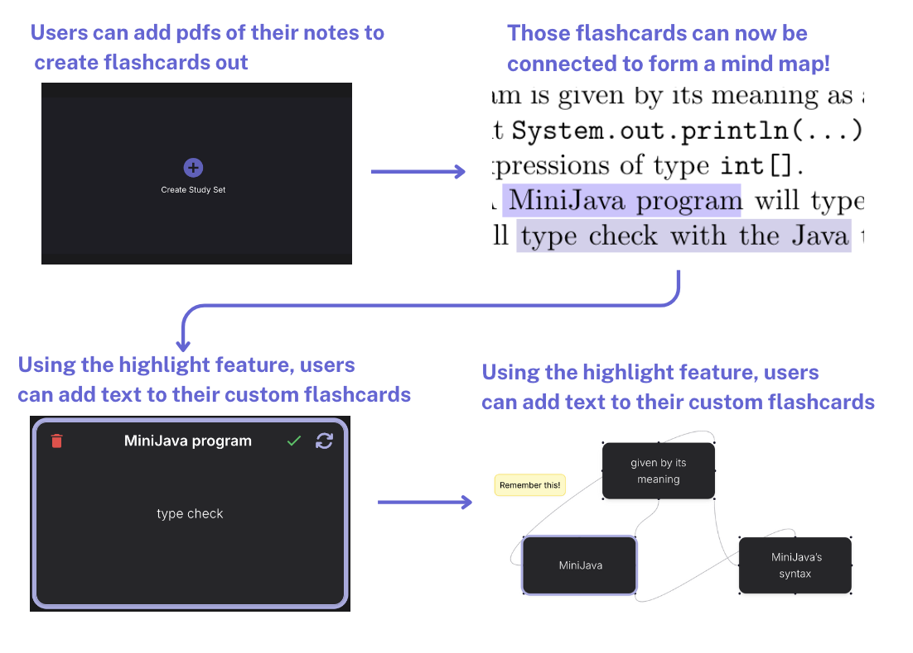

# **Nebula Final Blog Post**

## Introduction

College life involves more than just academics. Students must balance their time and energy across classes, extracurriculars, jobs, and other commitments. However, exams often take center stage, leaving students scrambling to study as deadlines pile up. As fellow students navigating the same demands, we set out to explore how learners, particularly those studying life sciences, can make the most out of their time in college and improve academic performance. In this study, we focus on 3 learner groups — non-majors, novice majors, and expert majors — with the goal of identifying patterns in their study habits and addressing unmet needs with a digital studying tool.

Thus, we have researched the following questions:
- What are some similarities and differences across learners with varying motivations, studying preferences, and learning challenges? 
- When and how do they learn best as well as struggle? How can we create a solution that supports this diversity? 
- Do subject and timeline play a role in students’ studying approaches? 
- Can we build upon or contribute something meaningful to popular tools like flashcards, note taking apps, and mind-maps?

## User Research

### Assumptions and Personas

One of the first big things our team recognized is that different subjects will require different types of studying and techniques. Therefore, we decided to narrow our scope to life science subjects and classes. This means that, for this study, we looked for students who have taken life science classes before. We then further assumed that students will have access to digital devices (computers, phones, etc.) that they can choose to use. We feel this is a good assumption to have, due to us trying to develop a tool for students on physical electronic devices devices. Finally, for our study, we further assumed that students will fall under 3 groups based on their school standing and major, denoted as follows: 

1. Non-Life Science Majors:
    1. **Collin** is a 2nd-year Stats & Data Science major taking Phy Sci 5 for a life science GE (he has previously taken LS 15 and AP bio in high school). He only uses his laptop for school — he’s not a fan of physical notes or iPad notes. He’s recently joined a consulting club and is preoccupied with his onboarding project. He’s outgoing, active, and responsible, but definitely a crammer when it comes to exams, and hates the amount of memorization required for a class he thought would be an easy A.
    
    
    
    
2. Life-Science Major (Novices):
    1. **Alex** is a 1st-year MCDB major on the pre-med track who has only taken lower division life science prerequisites as of yet. He’s primarily concerned with getting good grades to get into med school, and sometimes focuses more on grades than fully understanding his material, to his detriment. However, he is also actively looking for pre-med student organizations and volunteer opportunities, and trying to balance his social life on top of his coursework. A serious student who always stays on top of his lectures and notes, he would like to describe himself as an overachiever. 
    
    
    
3. Life-Science Major (Expert):
    1. **Emily** is a 4th year cognitive science major who has finished most of her upper division classes and is now primarily focused on recruiting for product management. She primarily takes notes on her iPad, and has solidified her study strategy. She is primarily focused on applying the knowledge she gained in her life science classes to a career, as she is currently completing a PM internship position at Pfizer as her capstone and pursuing concepts beyond the formal curriculum. A diligent and disciplined student with good time management, she has become skilled at balancing her time with her other extracurricular activities and meeting tight deadlines.
    
    
    

This comes with an implicit assumption that students in these 3 groups identified have distinct study habits.

As described in our “Discussion” section, we will find that some of these assumptions will be challenged by our study results.

### Method

For our method, we decided on a semi-structured interview format with a defined script and list of questions, but also allowing for some room of free discussion. We aimed for each interview to take ~30 minutes. In this script, we created 4 sets of questions which were given out depending on which group of student they fell under (as identified above in the *Assumptions* section).

1. **General Set:** These are questions about the interviewee’s background, how they study, what devices they use to study, what software tools (if any) they use to study and how they use them, and their evaluation of the tools they use. We also asked each participant if they vary their study techniques depending on what they’re studying. As implied by the name of this set, we gave this set to all participants.
2. **Non-Life Science Student Set**: These are questions specifically geared towards non-life science majors, We tried to further their background in life science courses and the struggles they faced in their life science classes. We tried to identify the motivation and level of effort they put towards the life science classes they took as well as how different their study methodology for these classes compared to their major classes. 
3. **Novice Life Science Student Set:** These are questions specifically geared towards novice life science majors. We tried to gauge how these interviewees adjusted to primarily studying life sciences and any tips they found useful in their time studying life sciences so far.
4. **Expert Life Science Student Set:** These are questions specifically geared towards expert life science majors, based more around their experience conducting trial and error with different studying techniques in their life science classes and any tips or resources they wished they found earlier in studying life sciences.

After the questions, we then also sent out an additional survey with more quantifiable questions to help generate some more concrete numbers and data on students’ study habits.

### Results

We interviewed **6 non-life science** majors, **8 novice** life science majors, and **11 expert** life science majors, adding to a total of 25 participants. Of these participants, 21 go to UCLA, 3 go to USC, and 1 goes to Ohio State.

We first identified some overarching similarities in all our interviewees’ study preferences. All students, in some way or another, take notes during lecture, and almost all of them will use these same notes to review for their exams. However, there is a relatively even split between *how* these students take notes. A majority of them take notes digitally, but there is around an even split between people who take “handwritten” notes on their iPad and students who type their notes using software such as Google Docs or Markdown. Almost all students who take notes on a tablet noted that they liked to annotate the lecture slides, with many also noting that they liked to do a “second pass” by rewatching their lectures or going through their notes again, and adding information to help bolster their understanding. The remaining students take handwritten notes with pen and paper.

Interestingly enough, we found the studying timeline for life science majors is significantly longer compared to non-life science majors. Almost all life science major students mention starting at least 1-2 weeks away from an exam, compared to non-life science students saying they begin studying 1 week in advance at most. Furthermore, many life science major students noted that they like to study incrementally throughout that process.

All user groups seemed to similarly believe that visualizations, such as graphs or pictures, are good for understanding life science concepts. They often incorporate these visualizations into their notes through screenshots of lecture slides or by hand drawing the diagrams themselves (though timeliness in copying down the diagram is a deciding factor in which method to choose). 

Beyond note-taking habits, we found that almost everyone finds life science classes to be overwhelmingly more memorization heavy compared to classes they took in other subjects. To address this focus on memorization, many students mentioned using flash cards or mind maps to more efficiently study for their exams. However, it is also important to note that some students were turned away from these methods due to the time it takes them to set up templates for these methods. An example mind map for life science is shown below:

*(Image credits to: https://cambrilearn.com/blog/what-is-a-mind-map)*

Furthermore, our initial assumption about life science students studying primarily alone was debunked. We found through our research that life students actually prefer a good mix of both. Most students we interviewed said that they like to initially study alone and then review lecture content in group study sessions. We also assumed that students taking life science courses prefer learning visually. Our research showed that only two of the 25 students benefitted from visual learning, and the others didn’t prioritize visual learning, writing their notes as bullet points.

In summary, we noticed that time is ultimately one of the biggest factors in influencing a student’s study habits. Too much time required to copy down a diagram leads to copy and pasting, which students may find worse for reinforcing concepts. If they find that flashcards take too long to make (such as through Anki), that often means they don’t even try to use them. They follow similar logic for mind maps.

## Problem Statement
Professor Jun provided this feedback about the version of our problem statement we presented at the crit:

Our answer to this is that there is no issue with students not utilizing all study methods available to them, but they should have more choice in what they use, especially if setup time is a limitation on studying. Furthermore, our user research showed that such a tool could potentiallly be applicable outside of life science subjects. Thus, our revised problem statement is as follows:

**Students in memorization-heavy courses often rely on active recall and concept mapping to study but current tools like flashcards and mind maps address these needs separately. With limited time and other responsibilities to juggle, many abandon these tools due to limited learning value and tedious setup of the creation process.**

**Thus, we introduce Nebula, a studying tool aiming to combine the best of both worlds – mind maps and flashcards – to help students externalize relational structures between concepts for long-term memorization.**

## Design Goals
Our development process aimed to address the following design goals:
1. Simplify the flashcard and mind-map creation process to reduce the amount of choices irrelevant to studying users have to make.
   -  Our users identified not using these tools to study because of the time they take to set up. Therefore, this design goal fulfills the most important part of our problem statement, and our app is effectively useless without fulfilling this goal.
   -  Some user interview notes to support this include:
      -  
  
2. Ensure applicability across a wide range of academic disciplines.
   - A key finding of our user research was that a product like ours could benefit other memorization-heavy subjects outside of life sciences, such as operating systems, computer networks, and Supreme Court cases. Thus, we wanted our tool to be as broadly applicable as possible, and to create a fun, aesthetically pleasing, and inviting design that makes no mention of our product being geared towards a specific subject.
   - User interview notes to support this include:
     - 
  
3. Minimize the learning curve of Nebula’s interface.
   - We foresaw our novel flashcard/mind-map hybrid system being relatively unfamiliar to users, especially because some users were deterred from using tools such as Notion that offer a lot of flexibility and freedom at the cost of a steep learning curve.
   - We also wanted to minimize the number of UI elements on the screen to not overwhelm the user, and make a legend for the mind map/graph interface to make it less confusing for users.
   - Some user interview notes to support this include (when we asked about use of study software):
     - 
     - 

On our design goals core assignment, the course staff denoted the following as our key interactions:
   1. Creating the skeleton mind map with a new set of flashcards (does not include the uploading process)
   2. Upload/convert typed study materials to a schema that can be converted to a skeleton mind map
   3. Adjusting the mindmap (including things like autolayout, connections, etc.)

We have modified our user interface slightly since then, but this gave us a sense of direction on what to implement.

## Design and Development Processes
Our first step in designing our system was to research preexisting study tools and gain some inspiration from them in designing a color scheme and some of our UI components. These tools include Quizlet, Anki, Prezi, Obsidian, Figma, and a mind map creation tool called Xmind.

Next, we came up with a set of UI Semantics, denoted as follows:
1. 3 Primary Design Rules
   - If it's not an annotation or edge, it's a flashcard.
   - Only show an edge, if the two cards are true connected and shown on screen.
   - Otherwise, it is considered part of the trunk.
2. Flashcard Creation Phase:
   - Users should be able to highlight two different colors. Front of flashcard and back of flashcard corresponds to highlighters.
   - Start on the front of the flashcard. A user can choose to flip it at any time.
   - Any additional highlights beyond the initial highlight would be appended to the current highlight.
   - Highlights corresponding to past flashcards should be grayed out.
   - Users cannot add a flashcard without both a front and a back.
   - User cannot move on to the next flashcard until they finish the current flashcard.
   - Users can click on the current flashcard text (on the actual flashcard) to be able to edit. 
   - Have a confirm button to create a flashcard and be able to move on to a new flashcard.
   - Flashcard content is scrollable.
   - History sidebar -- shows past flashcards made from oldest at the top to newest at the bottom.
3. Connection Stage
   - Nodes have connection dots. Drag from a side dot of one node to a corner dot of another node to connect nodes.
   - Connection edges should have text labels (by default, they say "relates to").
   - Users can add annotations and flashcards to their mindmap from the graph view.

We also wanted to implement grouping of flashcards, but our workloads and limited time for implementation meant that we could not get to anything related to flashcard groups. The semantics we designed relating to this include:

4. Grouping Phase
   - Drag one card onto another to add the target flashcard’s group (with target flashcard being the root).
   - When collapsed, it shows a stack of flashcards (just two) with the number of how many flashcards within being +x in the corner.
   - When the user wants to add a flashcard to a nested group, drag the card onto the top level group, the group expands down like a Mac folder expansion and the expansion will continue forward and the user chooses the specific flashcard to add to.
   - Double click to expand group one layer. Full click to fully expand out the group.
   - All nested group connections out of the group are also part of the trunk.
5. Mini-map
   - Shows the most recent group and the parent group. Select a node, a newly made flashcard will automatically be made into part of that group. Otherwise, it will be independent (root flashcard).

Our tech stack for this tool included React with TypeScript, Node.js, and React Context to save state. Our project notably lacked any form of backend due to time constraints on our implementation, but this is something that some of us will continue to implement during the summer. We decided to use the React Flow and React PDF Highlighter libraries to support our design goals, both because they're free and open source, and because Ollie used both of these libraries on his project.

Ultimately, our system can be viewed as such:

## Evaluation
As we continued our implementation, we began to conduct user evaluations on our system. Our primary motivating questions for our evaluation were as follows:
1. How easy is our product to use for people without a CS background?
2. How effective is our product for improving the efficacy of study routines?

We conducted __ cognitive walkthroughs of our tool in order to answer these questions. A basic skeleton for our cognitive walkthrough looked like this:
- Hi, my name is \___ and I’ll be the facilitator, along with ___ who will be taking notes (doesn’t necessarily have to be different people).
- We brought you here because we’re making a study application and would like people to test our product. Before we start, I just wanted to let you know that we will be taking notes during this, if that’s okay.
- (Start on home page. First, see if the user can figure our how to make flashcards on their own. If not, then explain)
  - Possible explanation: To make a flashcard, you highlight the page for the front, you can edit the flashcard front, then flip the flashcard and highlight for the back. Again, you can also edit the back yourself. Add the flashcard to the sidebar and repeat.
- (Once they’re done making however many flashcards they need, go the the graph interface. Try to connect flashcard/nodes together, add annotations to edges, and annotations to the graph).
  - Possible explanation: Drag from a side dot of one node to a corner dot of another node to connect nodes. Click on the + button to create new flashcards and edit them as you please.

## Findings
We conducted 16 usability tests on people we knew who had not already been a part of our user research.

Most feedback we received was related to bugs in our implementation and desires for future changes. Notably, most users pointed out how the highlighting process was buggy, and that the interface to edit a flashcard from the graph view is too small. Some of our users could not figure out how to create a flashcard with the given interface on their own, but others could, and most users stated the app would benefit from some form of written instructions or a tutorial video. Overall, these findings gave us a solid base to iterate on as we conducted the usability tests, and further beyond this class.

## Discussion
### Limitations
There are several key limitations to consider in the finds of both our user research and our usability evaluations. Namely, we only conducted 25 user interviews of mostly undergrad life science majors, as we initially assumed that our tool would be primarily geared toward life science students. Conversely, many of our usability evaluations were conducted on CS majors (as we either already surveyed or interviewed many of our non-CS friends). Thus, for future rounds of usability testing, it would be vastly beneficial to target people of a representative sample of majors and education levels.

### Future Work
Besides the previously mentioned design and implementation goals that we didn't have time to get to this quarter, we also have several unmet research goals.

We would first like to evaluate the competitor landscape of similar mindmap/flashcard based study tools, such as Notion and XMind, in terms of their primary features and UI, and apply some of their design principles to our product. We have done this to an extent in our initial design, but we would still like to expand on it.

Moreover, we would like to conduct more in-depth user research about mindmaps, and additionally, narrow certain software tools to integrate/develop off of. We would do this in the form of:
1. Online expert interviews, with at least a life science core subject professor and a psychology professor
2. In-person observations of students studying in libraries (e.g. biomed), cafes, etc., and dropping in on life science lectures to observe how they take notes, when they pay attention/get distracted, and when they look confused.
3. Contextual inquiries (in-person), through hanging out with friends studying for life science classes, and taking notes + asking questions
4. More think-aloud studies (in-person)
 - Idea 1:
   - Have people study one topic with their regular notes, then another other with visualized notes (counterbalance the order of studying from regular VS visualized notes across participants). Compare their thoughts and performance on a mini quiz afterward.
   - Give both sets of notes to other people who those notes don’t belong to.
   - Give them a visualization representing the notes (to serve as an alternative to the notes). We are currently unsure of what this visualization would look like.
   - Have users study the notes and verbalize their learning process and understanding, once with the notes. If they need to reference the visualization, have them verbalize this and their reasoning for the decision.
   - Give them a post-study survey to reflect on the utility of the visualization, their understanding of the content, and exam preparedness.
     - Quantitative questions (rate on a scale of 1-5)
       1. How easy was it to navigate and understand the visualization?
       2. How effective was this visualization in helping you understand the content?
       3. How confident are you in recalling key points from the notes after using the visualization?
       4. How comfortable do you feel taking an exam on this material after using the visualization?
     - Qualitative questions
       1. What aspects of the visualization helped you the most in understanding the material? 
       2. What aspects were unhelpful? What do you suggest should've been done instead?
       3. How does this compare to your typical note-reviewing process?
       4. Would you use this method again for studying? Why or why not?
       5. If you had an exam tomorrow, what parts of the visualization would you go back to review?
 - Idea 2:
   - Have people externalize while completing some task(s) with an existing study tool. We are currently unsure if we'll predetermine which tool or if we'll allow them to choose, but we are leaning towards a predetermined tool, as some people may have already gone through the learning curve for preexisting study tools.
5. A participatory design/co-design activity (in later user research stages, not right now)
   - Examples include a card sorting activity for information architecture and restructuring components of an existing study tool.
6. More secondary research.

A paper we found evaluating the efficacy of mindmaps has been written by Association for Study of Medical Education and titled Mind mapping as a teaching resource (Edwards S, Cooper N). [Here](https://asmepublications.onlinelibrary.wiley.com/doi/epdf/10.1111/j.1743-498X.2010.00395.x) is a link to this paper. 

The main idea of the paper is how to apply mind maps as a teaching resource, specifically by medical instructors. It explores the potential applications of mind mapping in clinical education, how it can serve as an aid to preparing/reviewing lectures and as a note taking tool and in what contexts it can be used for, such as problem-based learning, small-group learning, and as an examination tool.

We think the paper goes very in depth about how mind maps can be applied to medical education. It examines the demands medical schools have on their students and how mind maps could serve as a great tool to help students meet and exceed those expectations. However, not only does this paper only focus on medical education, it also acts as an aggregate and compiles previous research done surrounding the subject. While that is not an issue, it only references one study that conducted surveys/research on medical students and repeatedly references Buzan, the creator of the modern mind map. We find the paper could improve by considering how others have iterated off of Buzan’s work and what are other interpretations of mindmaps.

If we were to conduct our own study/version of this paper. We think it would be beneficial for us to try to conduct a research experiment with medical students and measure the effectiveness of mind maps versus other studying tools in different contexts. To elaborate, the current paper only references one study conducted in another paper, The Efficacy of Mind Mapping as a Studying Technique (Farrand P, Hussain F, Hennessy E, 2002). In that study, medical students only used mind maps as a preparation tool for an exam. We can elaborate on these findings by creating similar experiments where students would have to use mindmaps to solve specific problems rather than prepare for an exam, or for instructors to have mind maps as part of their examinations/curriculum.v